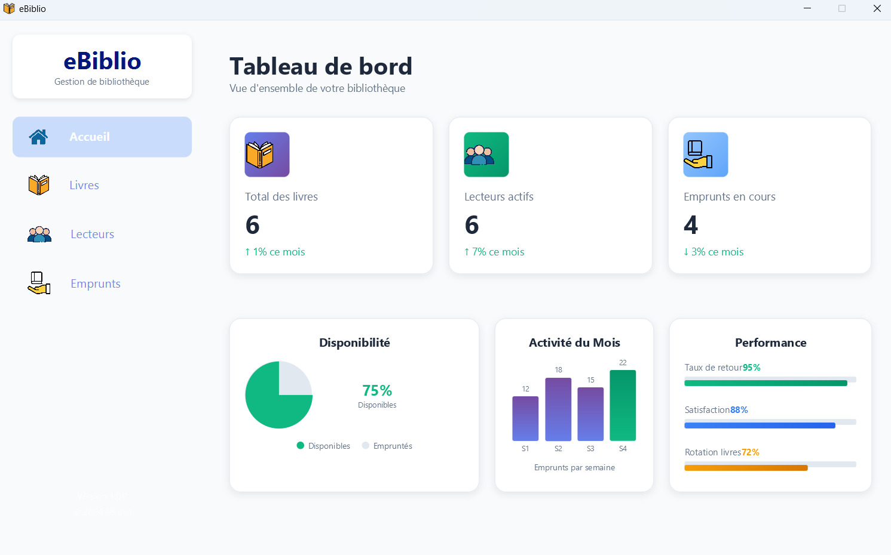
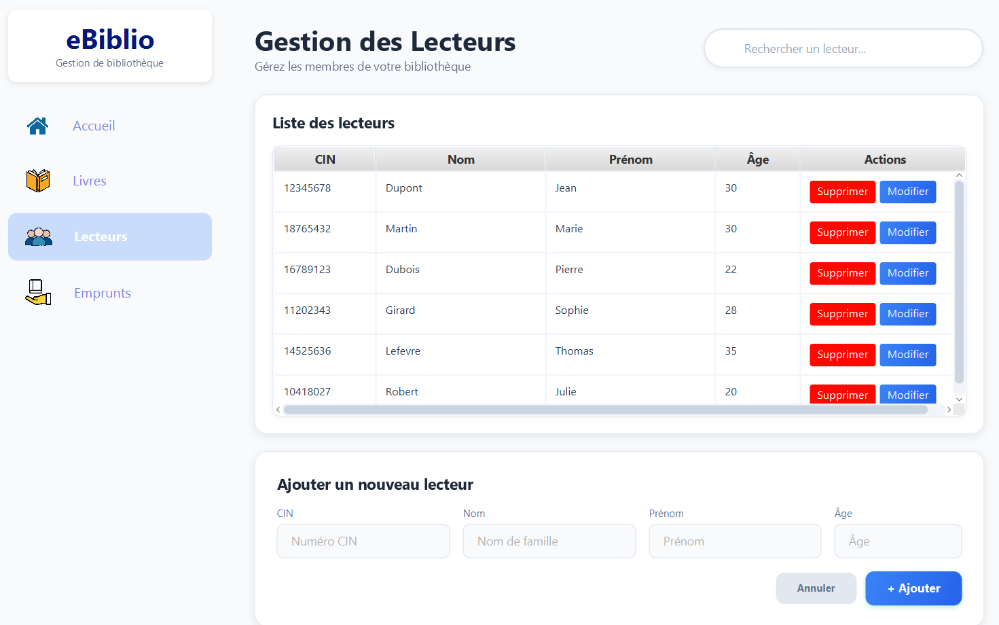
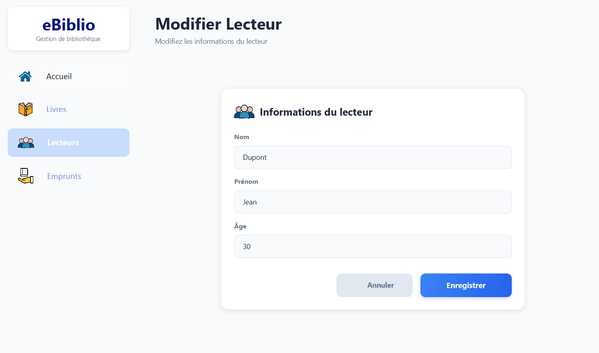
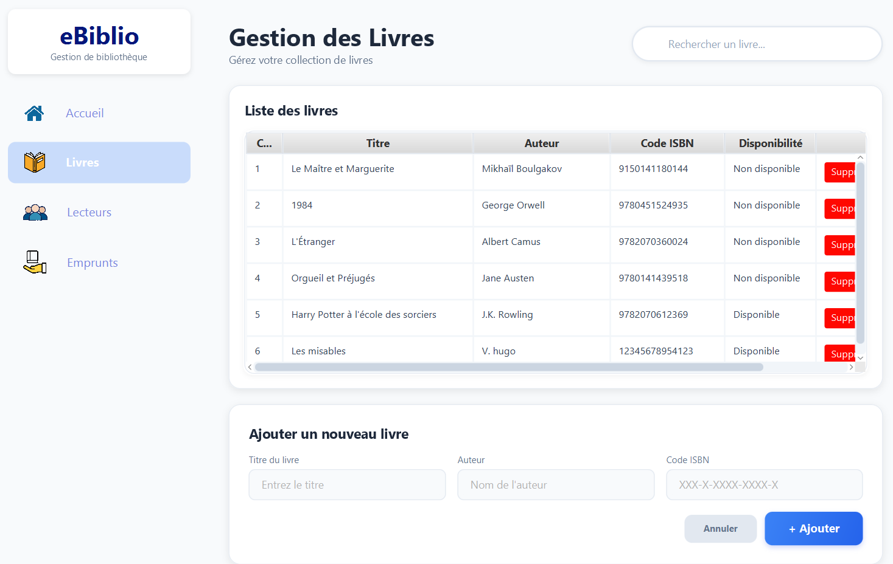
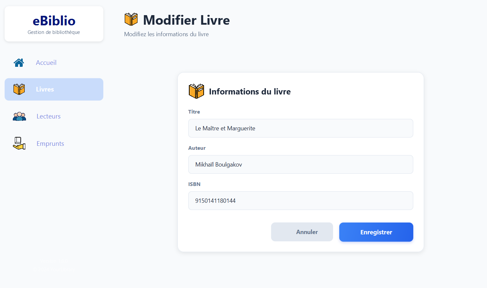
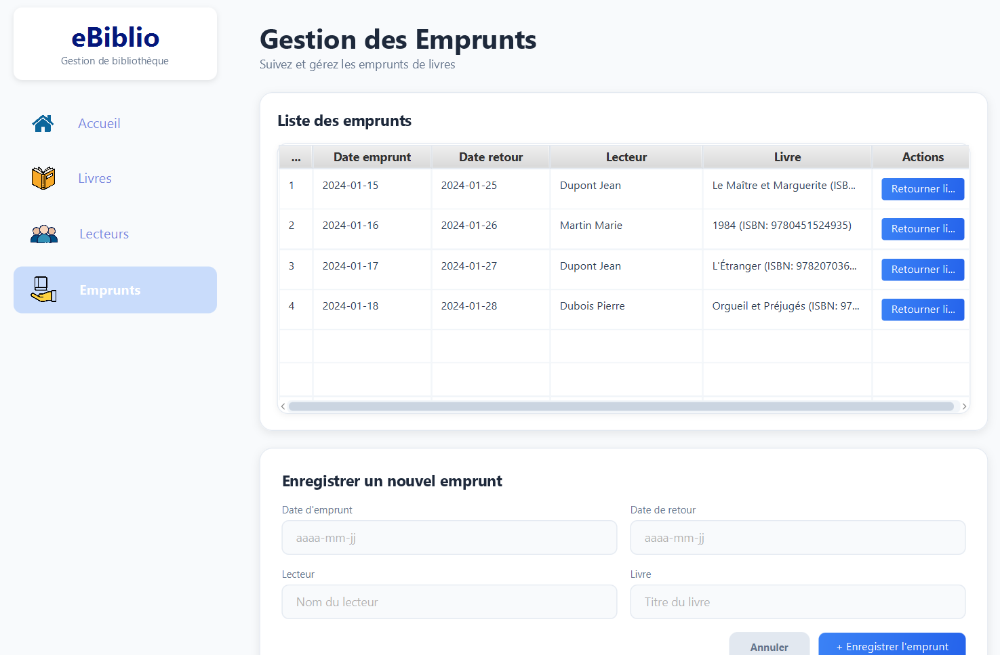

# eBiblio: Gestion de Bibliothèque avec java, JavaFX et mysql 

## À Propos de eBiblio: Description
eBiblio, notre application de gestion de bibliothèque développée en utilisant le framework JavaFX et MySQL, offre une variété de fonctionnalités conviviales grâce à ses interfaces intuitives. Découvrer comment chaque interface contribue à simplifier la gestion de votre bibliothèque. L'application inclut une base de données pour gérer les lecteurs, les livres, et d'autres éventuelles tables nécessaires.

## Fonctionnalités Principales

### Dashboard
Vous pouvez accéder rapidement aux statistiques. L'interface Dashboard fournit une vue d'ensemble de l'état actuel de votre bibliothèque.

---
---

### Lecteurs
Ajoutez, supprimez et recherchez des lecteurs. L'interface Lecteurs vous permet de visualiser et de mettre à jour les détails de chaque lecteur.

---
---

### Livres
L'interface vous permet d'ajouter de nouveaux livres, de les supprimer et de les rechercher.

---
---

### Emprunt de Livres
Facilitez le processus d'emprunt avec l'interface Emprunt de Livres. Suivez les transactions d'emprunt, identifiez les livres disponibles.

---
---

eBiblio s'engage à fournir une solution pour la gestion de bibliothèques. Simplifiez vos opérations quotidiennes.

**eBiblio - Simplifiez la Gestion de Votre Bibliothèque.**